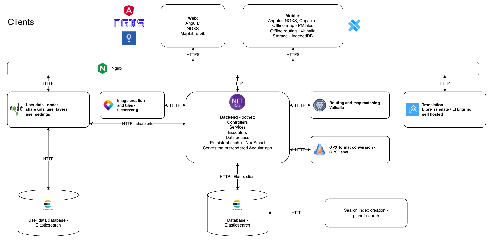

# Intro
This repository holds the main server side module the web and mobile clients interact with, it also hold the web and mobile related code.

[Site's uptime](https://aee25113-fdfb-461a-aa2f-f79fd9bcdce4.site.hbuptime.com/)

## Architecture Diagram

The diagram above is exported from [architecture.drawio](architecture.drawio) - edit that file and export a new png when the architecture changes.

## Third party services
The following services are used over HTTPS and are not a part of the deployment, so they are not in the diagram above:
* [OpenStreetMap API](https://wiki.openstreetmap.org/wiki/API_v0.6) - login, map edits and GPS traces
* [Overpass API](https://wiki.openstreetmap.org/wiki/Overpass_API) - points of interest queries
* [Wikidata](https://www.wikidata.org/) and [Wikimedia Commons](https://commons.wikimedia.org/) - points of interest descriptions and images
* [Mapbox](https://www.mapbox.com/) - satellite imagery
* [RevenueCat](https://www.revenuecat.com/) and [iaptic](https://www.iaptic.com/) - subscription receipt validation
* [Imgur](https://imgur.com/) - anonymous image upload
* mapeak.com - the offline map files and the offline routing tiles the mobile client downloads
* [Panoramax](https://panoramax.fr/), [iNature](https://inature.info/) and [Nakeb](https://www.nakeb.co.il/) - content the clients fetch directly

# Technology stack
The technology stack of this site is based on the following frameworks:

## Server Side
* [Asp.Net core](https://docs.microsoft.com/en-us/aspnet/core/) - infrastructure
* [NSubstitute](https://nsubstitute.github.io/) - for mocking in tests
* [Valhalla](https://valhalla.github.io/valhalla/) - for routing between points
* [Elastic Search and NEST](https://www.elastic.co/) - for database and search capabilities
* [Net Topology Suite](https://github.com/NetTopologySuite/NetTopologySuite) - for spatial mathmatics
* [OsmSharp](https://www.osmsharp.com/) - for OSM capabilities
* [NeoSmart.Caching.Sqlite](https://github.com/neosmart/SqliteCache) - for persistent cache, mainly to allow idempotent operations
* [Wikipedia using Wiki client library](https://github.com/CXuesong/WikiClientLibrary) - for Wikipedia data and upload images to Wikimedia common
* [Docker](https://www.docker.com/) - for image creation and microservices architecture

## Client Side
* [Typescript](https://www.typescriptlang.org/) - for sanity
* [Angular](https://angular.io/) and [Angular-Material](https://material.angular.io/) - for UI framework and components 
* [MapLibre](https://docs.maplibre.org/) using [ngx-maplibre-gl](https://github.com/maplibre/ngx-maplibre-gl/) - for map presentation and interaction
* [Vitest](https://vitest.dev/) - for unit testing
* [Capacitor](https://capacitorjs.com/) - for wrapping the site as a mobile application and add some native capabilities
* [Turf](https://turfjs.org/) - for spatial mathematics
* [NGXS](https://www.ngxs.io/) - for state management
* [Dexie](https://dexie.org/) - for database storage
* [D3](https://d3js.org/) - for advanced chart capablilities
* [Lottie](https://github.com/airbnb/lottie-web) and [ngx-lottie](https://github.com/ngx-lottie/ngx-lottie) - for image animations
* [Valhalla-mobile](https://github.com/rallista/valhalla-mobile) - for offline routing between points

# Architecture and folder structure of the client side
The architecture is based heavily on Angular:
* application - where all the application code is, topmost folder.
  * components - this layer handles the UI calls and bindings along with the relevant css and html files.
  * directives - folder for all the directives.
  * models - used to store data types that are common to the entire app.
  * reducers - used for redux reducers, actions and payloads.
  * services - this layer holds the lower level data handling.
* content - used for images and static content.
* environments - used for angular-cli to define production and dev variables.
* fonts - icon font generated by `npm run generate-icon-font`, see AGENTS.md.
* scss - used for global style files
* translations - all relevant data related to i18n.
 
# Architecture and folder stucture of the server side
The architecture is based on layers:
* API - the client entry point and main business logic module
  * Contollers - the top-most layer to catch all the requests
  * Services - responsible for orchestrating executors
  * Converters - converters logic between types of geo structures
  * Executers - basic logical building blocks
* Web - the entry point of the app and where the client side code gets built
* DataAccessInterfaces - a slim layer to decouple business logic from data access
* DataAccess - database, file system and network request are processed in this layer
* Common - Mainly for POCOs
* Tests - where the tests are located, they mirror the BL hierarchy

# Setup environment and start a debug session
[See the relevant page in our wiki](https://github.com/IsraelHikingMap/Site/wiki/Debug-Environment-Setup)

